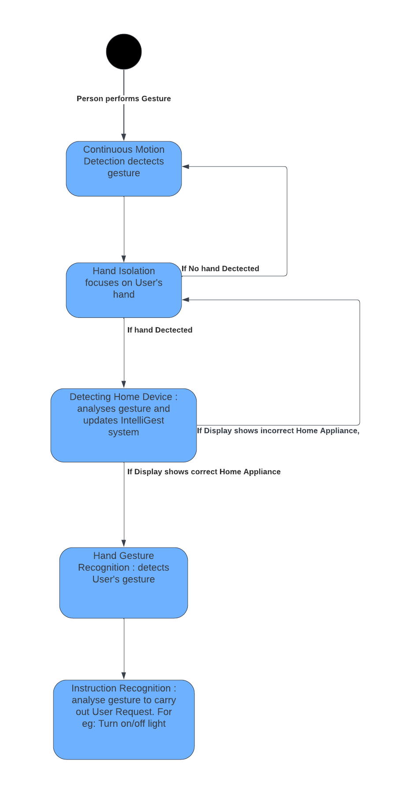

# Algorithms

import Figure from "../../src/components/Figure";

## Algorithms for Hand Signal Detection

<Figure caption={"Use UML State Diagram"}>

</Figure>

### Step 1: Continuous Motion Detection

The Raspberry Pi camera feed is monitored using OpenCV motion detection continually until motion is detected. Once motion is detected, [Step 2](#step-2-hand-isolation) is activated.

### Step 2: Hand Isolation

An OpenCV hand detection model is used to draw a box around the user’s hand. The hand will be cropped, then preprocessed for [Step 3](#step-3-device-choice). If no hand is detected for 5 seconds, this process will cease and return to [Step 1](#step-1-continuous-motion-detection).

### Step 3: Detecting Home Device

The prepared image of the hand will be input into an ASL recognition model, and the results from the model will be used to update the Raspberry Pi to show the intended device the user wants to send instructions to. A hand signal can be given to go back to [Step 2](#step-2-hand-isolation) if the model detects the hand gesture incorrectly.

### Step 4: Hand Gesture Detection

After the device is detected by the ASL recognition model, the hand detection model will be activated again to detect the user’s gesture

### Step 5: Instruction Recognition

The image will be processed and input into a gesture recognition model to detect the instruction given by the user. If it is a one step instruction such as turning on or turning off, or changing by one, the instruction will be carried out, and then return to step one. If it is a multi step instruction, such as setting to a certain number, the model will swap between the hand detection and gesture recognition model until the multi step instruction is complete. After the instruction is complete, it will be carried out and the process will return to [Step 1](#step-1-continuous-motion-detection).

### Example

A user walks in front of the camera, the motion detection recognizes this and the process moves to the next step. The user signals an “O” with their thumb and index finger, and the hand detection captures the gesture given by the user and sends it to the ASL recognition model. The model identifies this as the gesture for the locks, and displays the smart lock status on the screen. The user intends to lock the smart locks, so they gesture a thumbs up to the camera. This is detected by the gesture recognition model, and the instruction to lock all smart locks is carried out. After this, the Raspberry Pi returns to its original state

### Useful Resources

[ASL Translator](https://wecapable.com/tools/text-to-sign-language-converter/)

[Hand Detection Model Tutorial](https://www.analyticsvidhya.com/blog/2021/07/building-a-hand-tracking-system-using-opencv/)

## Model 2 Classes

<Figure caption={"Figure 1. Letter Mappings for Various Devices"}>

</Figure>

**From left to right:**
TV Lights, Alarm, Weather, Thermostat, Locks, Reminders, To-do list

### Letter Mapping Data Set

[Sign Language MNIST Data Set](https://www.kaggle.com/datasets/datamunge/sign-language-mnist)

## Model 3 Classes

Increase by 1/turn on, Decrease by 1/turn off, set number

<Figure caption={"Figure 2. Increasing and Decreasing with Set Numbers"}>

</Figure>

Finishing (only required for command using set numbers)

<Figure caption={"Figure 3. Completing a Request"}>

</Figure>

### Gesture Recognition Data Set

[Gesture Recognition Data Set](https://www.kaggle.com/datasets/imsparsh/gesture-recognition)
