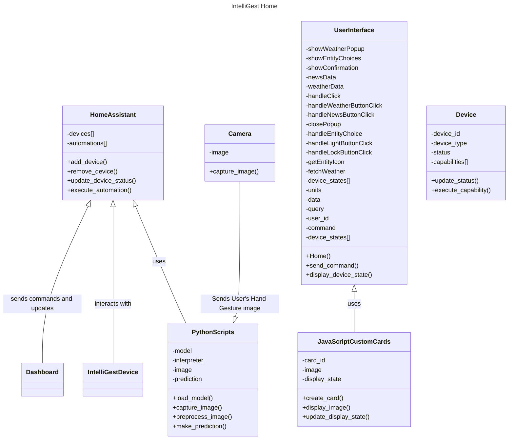

# Class Diagrams

## Components

### Home Assistant

Home Assistant is the core of our system, acting as the server. It’s responsible for managing the state of all connected devices and automations. It communicates with the user interface to display device statuses. It also communicates with the IntelliGest system (Raspberry Pi, Camera, Flask Server) and MediaPipe model to predict User's Hand gesture. It also interacts with the devices themselves to control their states based on user input and automation rules.

### Dashboard

IntelliGest's Dashboard allows users to interact with the system. It sends user commands to the Home Assistant and displays the status of the devices. The dashboard is highly customizable and can display information from various components. We will be creating custom cards for the dashboard to display ASL images.

### IntelliGest Devices

It includes the actual Smart Home Appliances: Lights, TV, Thermostats, Alaram, and Locks. This devices can be controlled. They communicate with Home Assistant to receive commands and send status updates. The devices are controlled using the built-in components provided by Home Assistant, but can be written to include other devices.

### Python Scripts

These are scripts that we will write to load the Machine Learning model to capture and pre-process images using OpenCV, and make predictions. The scripts will be run on a Raspberry Pi 4

The OpenCV library will be used to capture images or video frames from a camera connected to the Raspberry Pi. These images will then be preprocessed (e.g., resized, normalized) to be compatible with the input requirements of the TensorFlow Lite model.

The MediaPipe model has been trained to recognize ASL gestures. The preprocessed images will be passed to this model to make predictions.

### Javascript Custom Lovelace Cards

These are custom cards that we will create for the Home Assistant dashboard to display ASL images. The cards will be written in JavaScript and Home Assistant frontend development framework and will be used to enhance the user interface for our targeted demographic and provide necessary visual feedback when required.

## Class and Component Diagram

